# Práctica 3. Una red propia, dos máquinas y una aplicación

## 1. Identificación

**Integrantes:** Nelson Conde, Yoset Piedrahita y Jose Peres

**Proyecto de Google Cloud:** `project-dbb36c67-9183-4c5d-aff`

## 2. Diagrama de la infraestructura

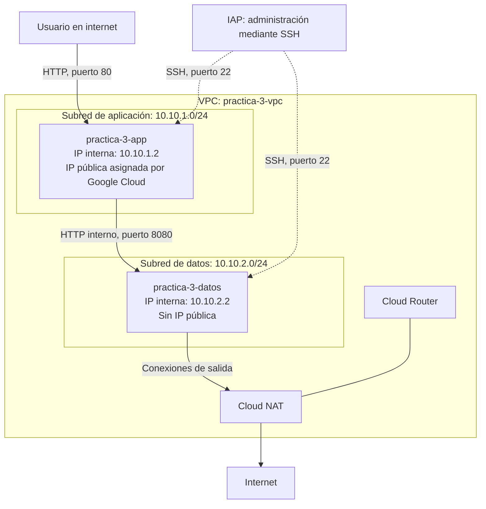

## 3. Evidencias

### Evidencia 0. Preparación del entorno


### Fase 1. La red y su subred

**Evidencia 1.** Lista de subredes con nombre, región y rango, y resultado del `terraform apply` con los dos recursos creados.

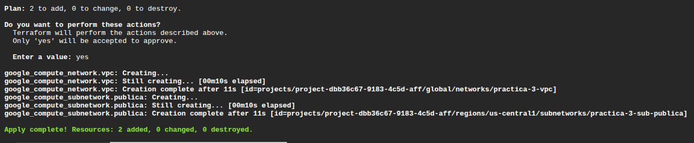

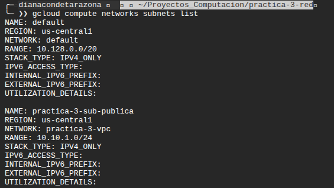

### Fase 2. Variables y salidas

**Evidencia 2.** Resultado completo de `terraform plan` sin cambios y de `terraform output` con los dos valores.

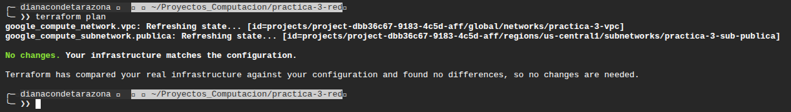

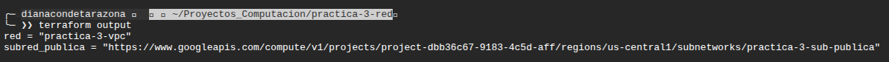

### Fase 3. La aplicación

**Evidencia 3.** Instancia conectada a la subred propia, con su dirección IP interna.

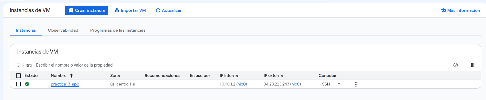

### Fase 4. Las puertas

**Evidencia 4.** Aplicación abierta con la IP visible, reglas de cortafuegos y sesión SSH mediante IAP.

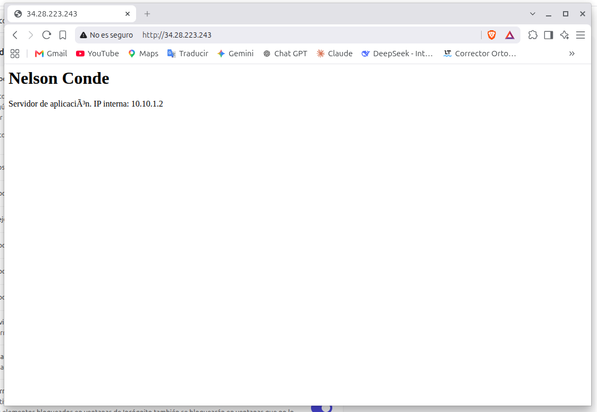

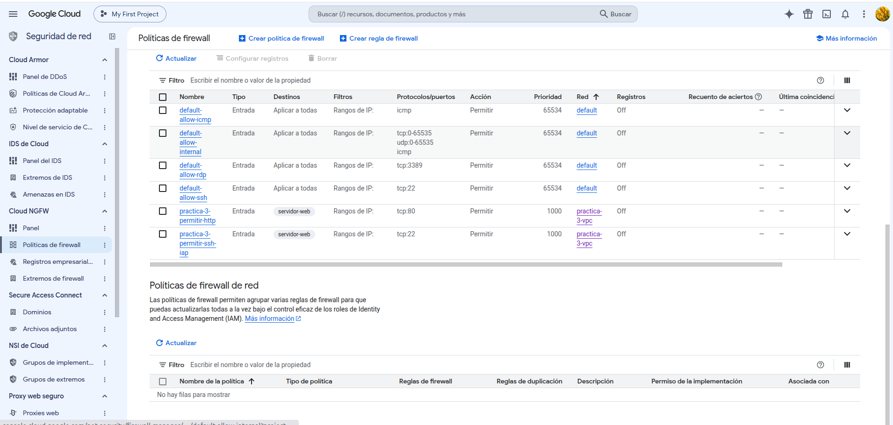

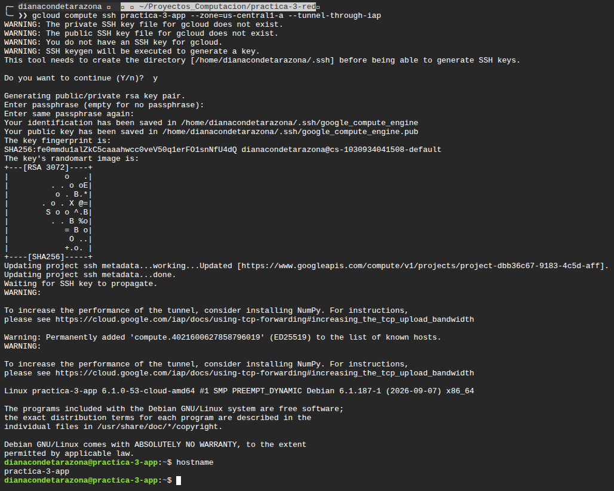

### Fase 5. Reproducir desde cero

**Evidencia 5.** Destrucción de los recursos, comprobación de los listados vacíos y reconstrucción de la infraestructura con la aplicación funcionando.

Se eliminaron los cinco recursos de la práctica mediante Terraform.

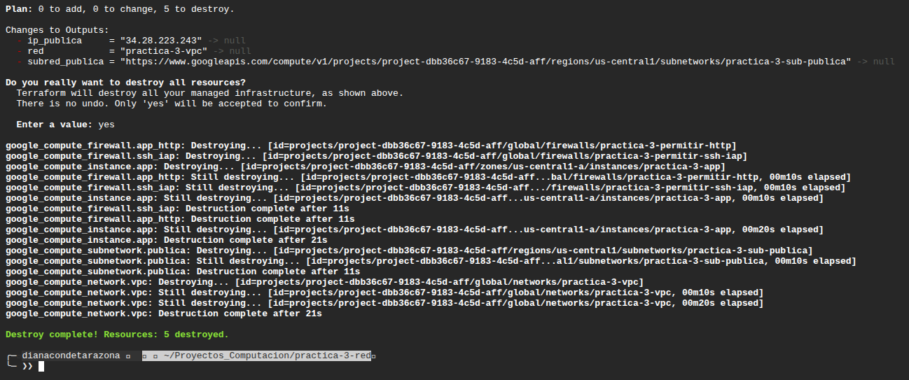

Después de la destrucción, se comprobó que no quedaban máquinas virtuales y que la red `practica-3-vpc` había sido eliminada. La red `default` permaneció en el proyecto.

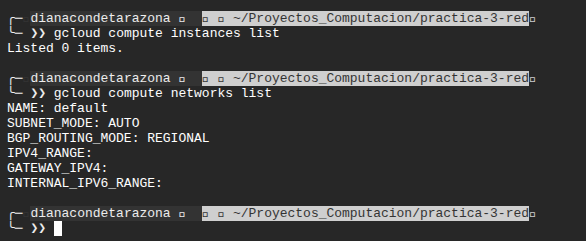

Se reconstruyó la infraestructura utilizando el mismo código de Terraform, con cinco recursos creados correctamente.

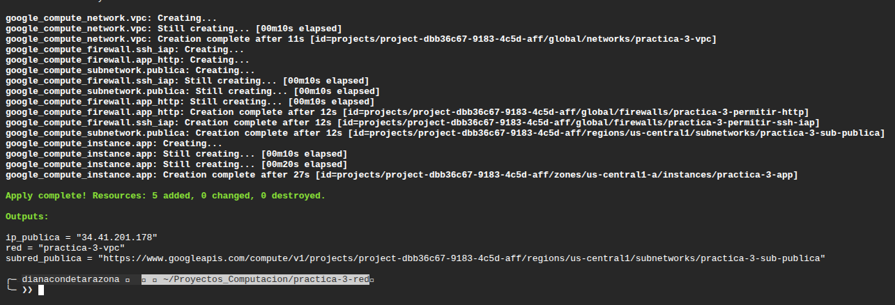

Finalmente, se comprobó que la aplicación volvió a funcionar. La máquina recibió una nueva IP pública: `34.41.201.178`, diferente de la anterior, `34.28.223.243`.

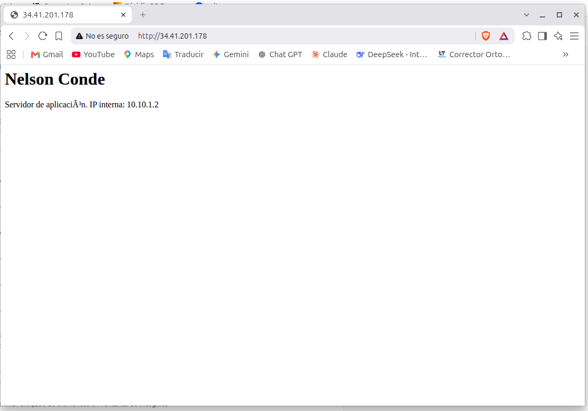

### Fase 6. La máquina que nadie puede alcanzar

**Evidencia 6.** Se creó una segunda subred con una máquina sin IP pública. La aplicación consulta el servicio de datos mediante la dirección interna de esa máquina y muestra la información recibida.

La siguiente captura muestra la aplicación funcionando desde internet con el dato obtenido de la máquina privada.

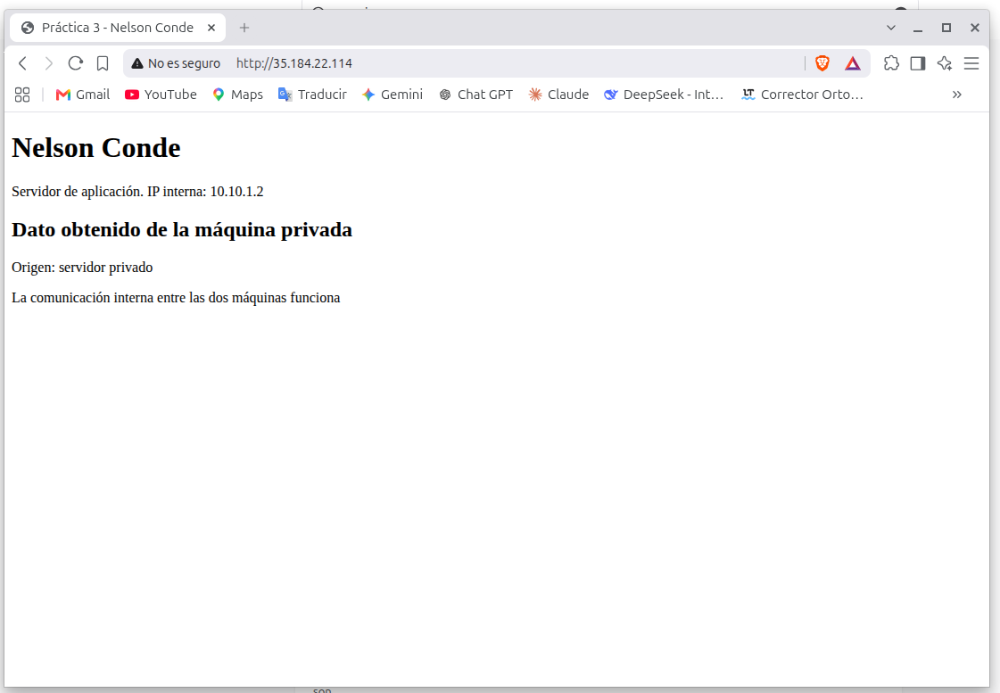

Desde la máquina de aplicación se consultó el servicio privado utilizando la dirección interna `10.10.2.2` y el puerto `8080`. El servicio respondió correctamente.

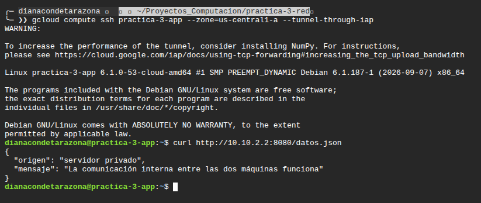

Finalmente, se comprobó que la máquina de datos no tiene IP pública y que el intento de conexión directa desde Cloud Shell no obtuvo respuesta.

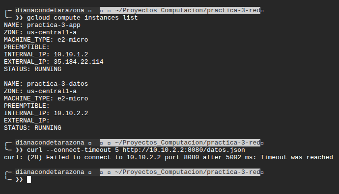

## 4. Comandos ejecutados

### Preparación del entorno

### Fase 1. La red y su subred

```bash
terraform init
terraform plan
terraform apply
gcloud compute networks subnets list
```

### Fase 2. Variables y salidas

```bash
terraform plan
terraform apply
terraform plan
terraform output
```

### Fase 3. La aplicación

```bash
terraform plan
terraform apply
terraform output
```

### Fase 4. Las puertas

```bash
git pull origin main
terraform plan
terraform apply
terraform output -raw ip_publica
curl http://34.28.223.243
gcloud compute ssh practica-3-app --zone=us-central1-a --tunnel-through-iap
hostname
exit
```

### Fase 5. Reproducir desde cero

```bash
terraform output -raw ip_publica
terraform plan -destroy
terraform destroy
gcloud compute instances list
gcloud compute networks list
terraform apply
terraform output -raw ip_publica
curl http://$(terraform output -raw ip_publica)
```

### Fase 6. La máquina que nadie puede alcanzar

```bash
gcloud config set project project-dbb36c67-9183-4c5d-aff
gcloud config get-value project
gcloud compute instances list
gcloud compute networks list

terraform init -input=false
terraform validate
terraform plan
terraform apply
terraform output

gcloud compute instances describe practica-3-datos --zone=us-central1-a --format="get(networkInterfaces[0].networkIP)"

curl -i --max-time 15 http://35.184.22.114/

gcloud compute ssh practica-3-app --zone=us-central1-a --tunnel-through-iap
curl http://10.10.2.2:8080/datos.json
exit

gcloud compute instances list
curl --connect-timeout 5 http://10.10.2.2:8080/datos.json
```

## 5. Decisiones de diseño

**1. Servicio y puerto:** Elegí un servicio HTTP en el puerto 8080 porque solo necesitaba que la máquina privada entregara un dato a la aplicación. Usar una base de datos habría añadido complejidad innecesaria.

**2. Organización de archivos:** Elegí mantener los archivos anteriores y crear otros para los recursos de la fase 6. Así puedo identificar los nuevos componentes sin modificar la organización de lo que ya funcionaba.

**3. Administración de la máquina privada:** Elegí SSH mediante IAP porque me permite administrar la máquina sin asignarle una IP pública ni exponer SSH directamente a internet.

**4. Direccionamiento:** Elegí 10.10.1.0/24 para la aplicación y 10.10.2.0/24 para los datos porque son rangos distintos que no se superponen. Si conectara esta VPC con otra red, tendría que comprobar que sus rangos tampoco coincidan.

## 6. Preguntas de análisis

### 6.1. Si le quitas la etiqueta de red a la máquina de aplicación y aplicas, ¿qué deja de funcionar exactamente, y por qué la regla de cortafuegos sigue existiendo?

Si quito la etiqueta `servidor-web` de la máquina de aplicación, dejaría de poder acceder a la página desde internet, entrar por SSH mediante IAP y consultar el servicio de la máquina privada. Esto ocurre porque las reglas de cortafuegos utilizan esa etiqueta para identificar a qué máquinas se aplican y, en el caso de la comunicación interna, cuáles pueden iniciar la conexión. Las reglas seguirían existiendo porque Terraform las administra como recursos independientes de la máquina.

### 6.2. ¿Por qué el plan de la fase 2 no propuso ningún cambio, si el código era distinto? ¿Qué habrías tenido que cambiar para que sí propusiera recrear un recurso?

En la fase 2 organicé la configuración usando variables y salidas, pero mantuve los mismos recursos y valores. Por eso, Terraform no encontró diferencias en la infraestructura y el plan no propuso cambios. Si hubiera cambiado el nombre de la VPC, Terraform habría tenido que reemplazarla, porque ese atributo no se puede modificar directamente en el recurso existente.

### 6.3. Con la red completa encendida, ¿cuánto costaría un mes? Desglosa por recurso y señala cuál es el que más sorprende.

Si mantuviera toda la infraestructura encendida durante un mes de 720 horas, el costo estimado sería de unos USD 21, distribuidos así:

| Recurso | Costo mensual aproximado |
|---|---:|
| Dos máquinas e2-micro | USD 12,06 |
| Dos discos pd-standard de 10 GB | USD 0,80 |
| IP pública de la máquina de aplicación | USD 3,60 |
| Cloud NAT para una máquina privada | USD 1,01 |
| Dirección IP pública utilizada por Cloud NAT | USD 3,60 |
| **Total estimado** | **USD 21,07** |

Lo que no sabia que Cloud NAT puede generar costos mientras está configurado, aunque la máquina privada no esté enviando datos. Por eso, al terminar las pruebas destruyo la infraestructura para evitar gastos innecesarios.
