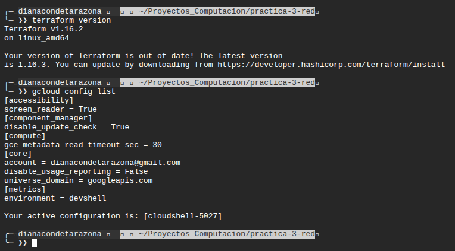

# Práctica 3. Una red propia, dos máquinas y una aplicación

## 1. Identificación

**Integrantes:** Nelson Conde, Yoset Piedrahita y Jose Peres

**Proyecto de Google Cloud:** `project-dbb36c67-9183-4c5d-aff`

## 2. Diagrama de la infraestructura

## 3. Evidencias

### Evidencia 0. Preparación del entorno

### Fase 1. La red y su subred

**Evidencia 1.** Lista de subredes con nombre, región y rango, y resultado del `terraform apply` con los dos recursos creados.

### Fase 2. Variables y salidas

**Evidencia 2.** Resultado completo de `terraform plan` sin cambios y de `terraform output` con los dos valores.

### Fase 3. La aplicación

**Evidencia 3.** Instancia conectada a la subred propia, con su dirección IP interna.

### Fase 4. Las puertas

**Evidencia 4.** Aplicación abierta con la IP visible, reglas de cortafuegos y sesión SSH mediante IAP.

### Fase 5. Reproducir desde cero

**Evidencia 5.** Destrucción de los recursos, comprobación de los listados vacíos y reconstrucción de la infraestructura con la aplicación funcionando.

### Fase 6. La máquina que nadie puede alcanzar

**Evidencia 6.** Diagrama de la red final, aplicación mostrando el dato de la máquina privada y pruebas de acceso externo e interno.

## 4. Comandos ejecutados

### Preparación del entorno

### Fase 1. La red y su subred

### Fase 2. Variables y salidas

### Fase 3. La aplicación

### Fase 4. Las puertas

### Fase 5. Reproducir desde cero

### Fase 6. La máquina que nadie puede alcanzar

## 5. Decisiones de diseño

**1. Servicio y puerto de la máquina de datos:**

**2. Organización de los archivos de Terraform:**

**3. Administración de la máquina sin IP pública:**

**4. Direccionamiento de las dos subredes:**

## 6. Preguntas de análisis

### 6.1. Si le quitas la etiqueta de red a la máquina de aplicación y aplicas, ¿qué deja de funcionar exactamente, y por qué la regla de cortafuegos sigue existiendo?

### 6.2. ¿Por qué el plan de la fase 2 no propuso ningún cambio, si el código era distinto? ¿Qué habrías tenido que cambiar para que sí propusiera recrear un recurso?

### 6.3. Con la red completa encendida, ¿cuánto costaría un mes? Desglosa por recurso y señala cuál es el que más sorprende.